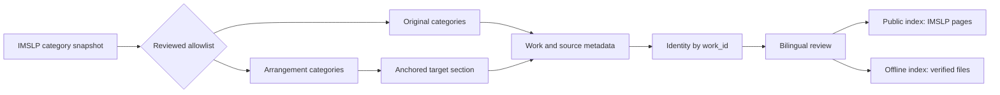

<p align="center">
  
</p>

<p align="center">
  <a href="https://lin-qian123.github.io/imslp-guitar/"><strong>Live catalogue</strong></a>
  ·
  <a href="README.md">中文</a>
  ·
  <a href="#quick-start">Quick start</a>
  ·
  <a href="#how-the-catalogue-is-built">Method</a>
</p>

<p align="center">
  
  
  
  
</p>

> A bilingual, source-linked map of classical guitar repertoire scattered across hundreds of IMSLP instrumentation categories.

`imslp-guitar` is not a pile of downloaded files. It answers four questions first: What is the **exact instrumentation**? Is this an **original or an arrangement**? Do records in different categories identify the **same work**? Can every public result return to a **trusted IMSLP source page**?

## Snapshot

| Measure | Count |
| --- | ---: |
| Exact IMSLP categories | **352** |
| Category memberships | **12,548** |
| Unique works after IMSLP `work_id` deduplication | **11,393** |
| Chinese work titles reviewed | **11,393** |
| Strictly valid score files in the complete offline library | **22,572** |
| Score-file links in the public site | **0** |

The repository deliberately produces two different views:

| Edition | Purpose | Links |
| --- | --- | --- |
| **Public site** in `public_site/` | GitHub Pages search and methodology sharing | Links each work to its IMSLP source page; hosts no score files |
| **Complete offline library** | Browsing on a computer or drive that holds the full collection | Links verified offline files and preserves IMSLP attribution |

The public export does not alter the complete offline view. Its deployable data contains no private disk paths, caches, download logs, or score files; Git tracks only code, configuration, review assets, and the score-free public catalog.

## What makes it useful

- **Bilingual discovery** across English and Chinese titles, composers, instrumentation, and category names.
- **Work-level results**: one IMSLP work appears once, with all approved category memberships attached.
- **Exact instrumentation** selected from reviewed allowlists; arrangement files must also match an anchored target section.
- **Originals and arrangements stay separate** from configuration through presentation.
- **Forgiving queries, strict sources**: accent- and punctuation-insensitive search, but only validated HTTPS IMSLP page links are exported.
- **Safe publication**: DOM text nodes render catalog values, and validation rejects disk paths, score URLs, and identity drift.
- **Auditable translations**: source titles are immutable identity fields; reviewed Chinese titles are keyed by `work_id`.
- **Archive-inspired browsing**: bespoke guitar-and-folio artwork, ensemble shortcuts, and responsive catalog cards keep a large collection calm and legible.

## How the catalogue is built



### Categories are not guessed from a keyword

Pure-guitar scope lives in [`config/categories.json`](config/categories.json); guitar chamber scope lives in [`config/mixed_categories.json`](config/mixed_categories.json). The project does not infer inclusion merely from the word `guitar`. Electric and bass guitar, voice/chorus, electronics/tape, and large-ensemble categories are outside the approved scope.

### Arrangement sections are anchored

Original categories accept original scores and parts. `(arr)` categories accept only the exact target-instrumentation subsection in the page's `FILES` area. Unicode and markup are normalized before a fully anchored match, preventing guitar-plus-voice or guitar-plus-extra-instrument sections from leaking into a smaller target category.

### Memberships, works, and files are different quantities

- A **membership** is one work appearing in one category.
- A **unique work** is one IMSLP `work_id`, even when it belongs to several categories.
- An **offline file entity** is identified by content digest—not by filename or category count.

The public search therefore returns 8 unique Tchaikovsky works rather than 10 repeated memberships. *The Seasons* appears once, with its three guitar instrumentation categories attached.

### Search behavior

The browser builds an in-memory normalized field from:

```text
work_id + English title + Chinese title + English composer + Chinese composer
        + every English category name + every Chinese category name
```

All query terms must occur, in any order. Unicode `NFKD`, diacritic folding, case folding, and punctuation normalization make input forgiving. Exact field matches, prefixes, and field-contained term matches are ranked first. Family, original/arrangement, and exact-category filters can be combined. Query state is written to the URL, so a search can be shared directly.

## Quick start

### Browse the public catalogue

The repository includes the generated compact catalog; no score download is required:

```bash
git clone https://github.com/lin-qian123/imslp-guitar.git
cd imslp-guitar
python -m http.server 8000 --directory public_site
```

Open <http://127.0.0.1:8000>.

### Run the checks

```bash
python -m venv .venv
source .venv/bin/activate
python -m pip install -e '.[test]'
python -m pytest -q
python scripts/validate_public_site.py public_site
```

### Re-export from a complete offline library

This command must run in a complete library that contains each category's `metadata/catalog.json`. It reads catalog metadata only; it does not read or copy score files.

```bash
python scripts/export_public_site.py \
  --root . \
  --output public_site/data/catalog.json
```

The export fails closed on cross-category identity drift, unresolved composer-name conflicts, missing or malformed catalogs, and non-IMSLP source URLs.

### Rebuild the complete offline home page

When the complete offline collection is present:

```bash
python scripts/render_master_index.py .
```

That command revalidates offline files and writes the root `index.html`. It is independent of the public-site export.

## Repository map

```text
imslp-guitar/
├── config/                         # Approved pure and chamber categories
├── metadata/translations/          # Reviewed title and composer names
├── public_site/                    # Deployable site without score files
│   ├── assets/
│   ├── data/catalog.json           # 3.1 MiB, deduplicated by work
│   └── index.html
├── scripts/
│   ├── export_public_site.py       # Complete library → public catalog
│   ├── validate_public_site.py     # Fail-closed release validation
│   ├── render_master_index.py      # Complete offline home page
│   └── imslp_library/              # Discovery, extraction, download, storage
├── tests/
├── DATA_LICENSE.md
├── THIRD_PARTY_NOTICES.md
└── README.md
```

## Copyright and data boundaries

This is an independent catalog project. It is not affiliated with or endorsed by IMSLP. The public site hosts no score files and links each work to its IMSLP page. Copyright status and file licenses differ by work and jurisdiction; always follow the status shown by IMSLP and within each file.

- Software: [MIT](LICENSE)
- Project-authored catalog structure, reference translations, documentation, and visual assets: [CC BY-SA 4.0](DATA_LICENSE.md)
- Source and attribution notes: [THIRD_PARTY_NOTICES.md](THIRD_PARTY_NOTICES.md)

## Known boundaries

- Chinese names are search-oriented reference translations. Only works with stable conventional Chinese names should be described as using an established title.
- The complete offline library still has 65 upstream records unavailable because of IMSLP copyright review, interactive verification, or superseded versions.
- The public catalog is a frozen snapshot. Upstream category drift must be reported and reviewed separately, never silently absorbed during deployment.

---

If this index helps you find a guitar work that was hiding deep inside an instrumentation category, share the search URL—or contribute a source-backed title correction.
