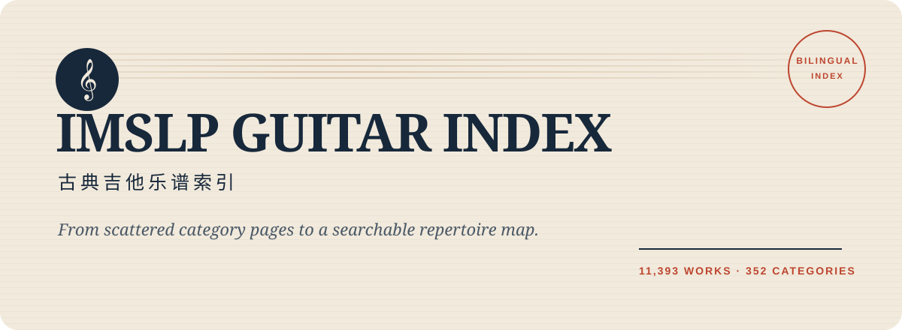
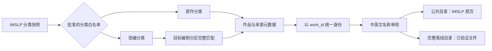

<p align="center">
  
</p>

<p align="center">
  <a href="https://lin-qian123.github.io/imslp-guitar/"><strong>在线检索</strong></a>
  ·
  <a href="README.en.md">English</a>
  ·
  <a href="#快速开始">快速开始</a>
  ·
  <a href="#整理与检索方法">整理方法</a>
</p>

<p align="center">
  
  
  
  
</p>

> 把散落在数百个 IMSLP 编制分类里的古典吉他作品，整理成一张可检索、可追溯、可复现的双语乐谱地图。

`imslp-guitar` 不是一个把文件简单堆在一起的下载站。它首先回答四个问题：这部作品属于哪个**精确编制**？是**原作还是改编**？不同分类里的记录是不是**同一部作品**？检索结果能否回到**可信的 IMSLP 来源页**？

## 一眼看懂

| 当前快照 | 数量 |
| --- | ---: |
| IMSLP 精确分类 | **352** |
| 作品分类关系 | **12,548** |
| 按 IMSLP `work_id` 去重后的作品 | **11,393** |
| 已审校中文曲名 | **11,393** |
| 本地离线库中验证有效的乐谱文件 | **22,572** |
| 公开网站中的乐谱文件链接 | **0** |

项目提供互不混淆的两套输出：

| 版本 | 用途 | 乐谱链接 |
| --- | --- | --- |
| **公共网站** `public_site/` | GitHub Pages 在线检索、分享整理方法 | 每部作品直达 IMSLP 原页，不托管乐谱文件 |
| **完整离线库** 根目录生成页 | 在持有完整资料的电脑或硬盘上浏览 | 指向已验证的离线乐谱文件，同时保留 IMSLP 来源 |

公共网站导出不会改变完整离线版；其部署数据不包含私人磁盘路径、缓存、下载日志或乐谱文件。Git 仅跟踪程序、配置、审校资产和无乐谱文件的公共目录。

## 为什么这个目录更好用

- **跨语言检索**：中文曲名、英文原名、中文音乐家名、英文音乐家名、编制分类都能搜索。
- **按作品去重**：同一作品出现在多个编制分类时，只显示一次，并列出全部分类关系。
- **精确编制**：范围由审核过的分类白名单决定；改编谱还要匹配页面中明确的目标编制分区。
- **原作与改编分离**：`For guitar` 与 `For guitar (arr)` 从配置、目录到展示始终独立。
- **宽松输入，严格来源**：检索忽略英文变音符号和关键词顺序，但导出只接受 HTTPS 的 IMSLP 页面链接。
- **安全公开**：页面使用文本节点渲染目录数据；发布检查会拒绝磁盘路径、乐谱地址和跨分类身份冲突。
- **可审计翻译**：英文原名永远是身份字段，中文只作为参考译名；最终曲名按 `work_id` 锁定。
- **翻谱一样浏览**：浅纸色页面、吉他与旧谱插画，中文曲名配原名。作曲家可以一键找，详细编制按需展开，手机上也能顺手翻。

## 整理与检索方法



### 1. 分类不是关键词猜测

项目不会因为分类名里出现 `guitar` 就自动纳入。纯吉他分类来自 [`config/categories.json`](config/categories.json)，吉他与其他乐器及室内乐分类来自 [`config/mixed_categories.json`](config/mixed_categories.json)。电吉他、贝斯吉他、人声/合唱、电子/磁带及大型乐团等超出范围的分类会被排除。

### 2. 改编谱必须命中目标分区

原作分类只收录原作谱；`(arr)` 分类只接受页面 `FILES` 区域中与目标编制完整匹配的分区。编制字符串在清理 Unicode 和页面标记后进行锚定匹配，避免把“吉他加人声”“吉他加额外乐器”误判成目标重奏。

### 3. 三种数量分开计算

- **分类关系**：一部作品属于一个分类，记一条。
- **唯一作品**：相同 IMSLP `work_id` 只记一次。
- **文件实体**：离线库按内容摘要识别文件，不能用文件名或分类数冒充唯一文件数。

公共检索以唯一作品为单位，因此“柴可夫斯基”当前显示 8 部作品，而不是重复的 10 条分类关系；《四季》会在一张结果卡片中列出它所属的三个吉他编制分类。

### 4. 搜索如何工作

浏览器会建立一个只存在于内存中的规范化检索字段，覆盖：

```text
work_id + 英文曲名 + 中文曲名 + 英文音乐家名 + 中文音乐家名
        + 所有英文分类名 + 所有中文分类名
```

查询忽略大小写、重音符号、常见标点和部分繁简字差异，也能识别 `Op.9` / `op9` 这类写法。多个关键词可以调换顺序，但不会悄悄丢掉其中某一个；编号按完整数字匹配。

- **异译名**：搜索“塔瑞加”“萧邦”“德布西”或 `Tschaikowsky`，可以找到目录中的对应音乐家。别名表目前覆盖 33 位作曲家和 7 个作品条目，保存在 [`search-aliases.json`](public_site/data/search-aliases.json)，可以继续补充。
- **拼写容错**：没有精确或别名结果时，尝试少量漏字、错字和相邻字母颠倒。例如 `Tchaikovky` 仍能找到柴可夫斯基。近似结果会明确标注；数字、很短的词和相差过大的输入不会随意纠正。
- **边写边找**：输入时推荐最多 6 个作曲家或曲目，可点击、触控，或用上下键和 Enter 选择；Esc 先收起建议，再按一次清空。
- **筛选仍然有效**：模糊结果与建议都遵守当前编制条件。没有结果时可保留关键词、放宽编制。检索状态写入 URL，分享后可以恢复。

检索全部在浏览器中运行，不将关键词发送给外部搜索或 AI 服务。异译名仅帮助检索，不覆盖原名或审校译名；模糊匹配也不代表作品身份相同。别名表不是完整翻译词典，组曲内的乐章只对已明确收录的别名提供入口，例如 [《贝加莫组曲》内的《月光》](https://imslp.org/wiki/Suite_bergamasque,_CD_82_(Debussy,_Claude))。

## 快速开始

### 浏览公共网站

仓库已经包含生成好的精简目录，不需要下载乐谱文件：

```bash
git clone https://github.com/lin-qian123/imslp-guitar.git
cd imslp-guitar
python -m http.server 8000 --directory public_site
```

打开 <http://127.0.0.1:8000>。

### 运行测试

```bash
python -m venv .venv
source .venv/bin/activate
python -m pip install -e '.[test]'
python -m pytest -q
node --test tests/search.test.cjs  # Node.js 22+，无需 npm 依赖
python scripts/validate_public_site.py public_site
```

### 从完整离线库重新导出公共目录

此命令需要在拥有各分类 `metadata/catalog.json` 的完整资料目录中运行；只读取目录元数据，不读取或复制乐谱文件：

```bash
python scripts/export_public_site.py \
  --root . \
  --output public_site/data/catalog.json
```

导出器会在以下情况中止，而不是生成一个“看起来能用”的错误网站：

- 同一 `work_id` 在不同分类中的曲名、音乐家或来源页不一致；
- 音乐家中文名存在未解决的跨分类冲突；
- 分类目录缺失或 JSON 结构损坏；
- 作品或分类链接不是合法的 IMSLP HTTPS 页面。

### 重新生成完整离线总页

在持有完整离线资料时：

```bash
python scripts/render_master_index.py .
```

这条命令会重新验证离线文件并生成根 `index.html`。它与 `public_site/` 的导出过程相互独立。

## 项目结构

```text
imslp-guitar/
├── config/                         # 已批准的纯吉他与室内乐分类
├── metadata/translations/          # 曲名与音乐家中文名审校资产
├── public_site/                    # 可直接部署的无乐谱文件网站
│   ├── assets/                    # 页面样式、交互与独立检索引擎 search.js
│   ├── data/catalog.json           # 3.1 MiB，按作品去重
│   ├── data/search-aliases.json    # 仅供检索使用的人名与曲名别名
│   └── index.html
├── scripts/
│   ├── export_public_site.py       # 完整资料 → 公共目录
│   ├── validate_public_site.py     # 发布前失败即停的检查
│   ├── render_master_index.py      # 完整离线总页
│   └── imslp_library/              # 分类、抽取、下载与存储核心
├── tests/
├── DATA_LICENSE.md
├── THIRD_PARTY_NOTICES.md
└── README.en.md
```

## 数据与版权边界

本仓库是独立目录项目，不隶属于 IMSLP，也不代表 IMSLP。公共网站不托管乐谱文件；每条作品都链接到 IMSLP 原页面。不同文件的公版状态和许可证可能不同，并随司法辖区而变化，请以 IMSLP 页面和文件自身标注为准。

- 程序代码：[MIT](LICENSE)
- 项目编写的目录结构、参考译名、文档和视觉资产：[CC BY-SA 4.0](DATA_LICENSE.md)
- 来源与第三方说明：[THIRD_PARTY_NOTICES.md](THIRD_PARTY_NOTICES.md)

## 当前边界

- 中文名是检索用参考译名；只有具有稳定通行名的作品才采用通行译名，不能把全部参考译名表述为出版社正式译名。
- 完整离线库仍有 65 条上游记录受 IMSLP 版权复核、交互验证或旧版本替换影响而暂不可取得。
- 公开目录发布的是冻结快照。上游分类变化必须先单独报告并审核，不能在部署时静默改变范围。

---

如果这个索引帮你找到了一首原本藏在分类深处的吉他作品，欢迎分享检索链接，或提交一个带来源的译名修正。
